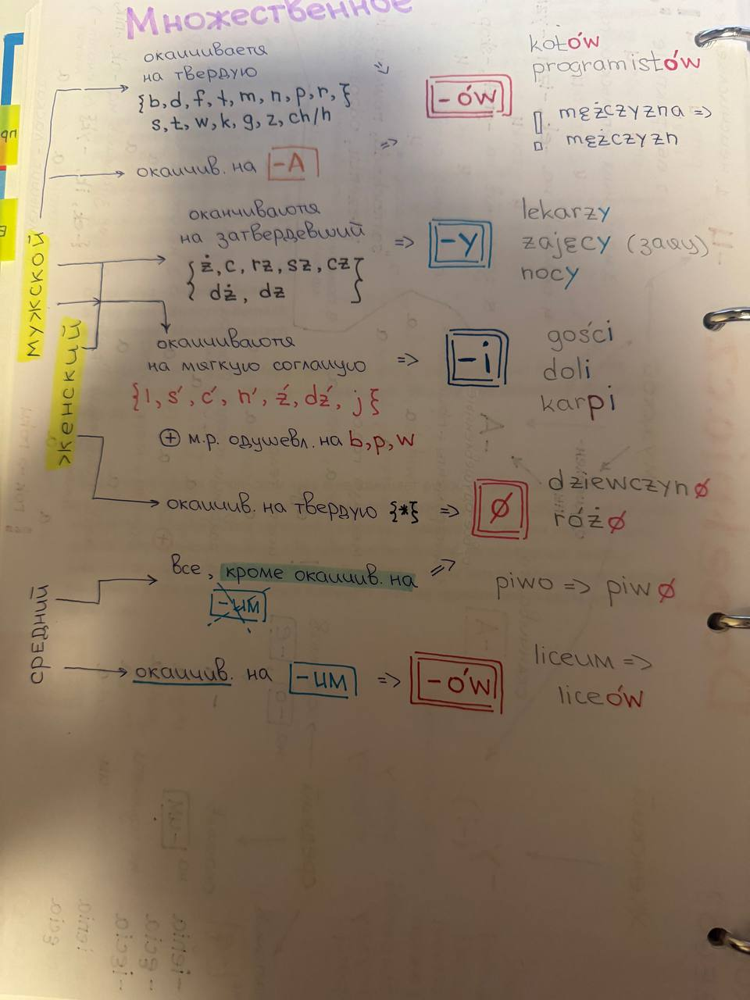
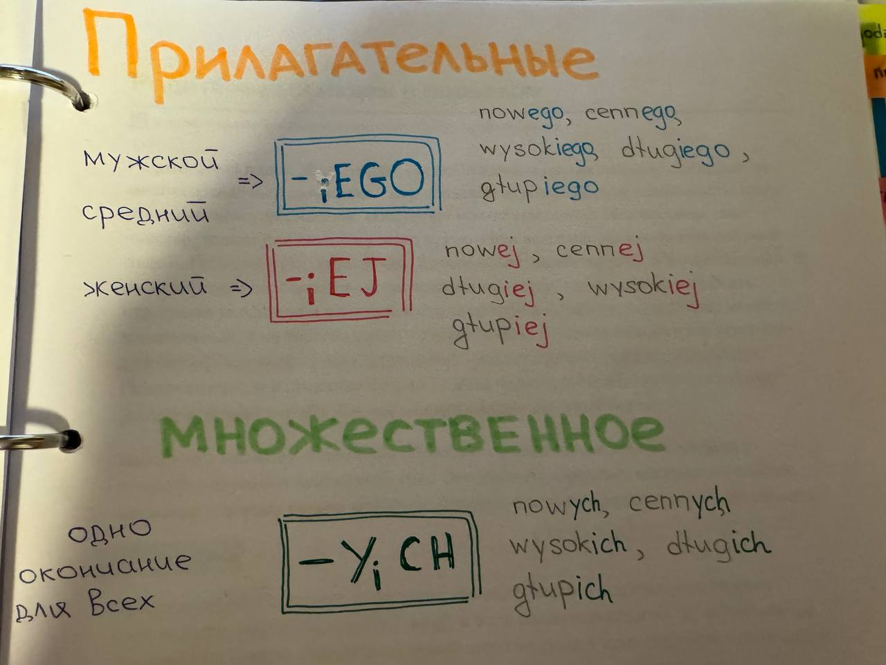

1. zabrakło mu **pieniędzy**
2. wydaliśmy 5 **tysięcy** złotych

2, 3, 4 tysi**ą**c**e**
5-21, 25-31... tysi**ę**c**y**

1.  **bać się** Boga; rywali; burzy, ciemności, kary, kompromitacji, konkurencji, konsekwencji, kontroli, krytyki, lustracji, odpowiedzialności, ośmieszenia, podejmowania decyzji, przyszłości, pytań, śmierci, raka, reform, ryzyka, wyzwań, zemsty; skutków, ujawnieni
2. brakować
3. dotykać
4. nienawidzić
5. odmawiać (czego?)
6. **pilnować** debiutu
7. **potrzebować** 
8. próbować (czego?)
9. **gratulować** awansu, debiutu, jubileuszu, nominacji; książki, tekstu 
10. słuchać
11. szukać
12. **zwierzać się z** kłopotów, z problemów, ze swoich niepokojów, ze swoich uczuć, z tajemnicy, z trosk, ze zmartwień
14. uczyć się (czego?)
15. unikać (=избегать)
16. używać (czego?)
17. wstydzić się (=стыдиться)
18. wymagać (czego?)
19. zabraniać (czego?)
20. zapomnieć (=забывать)
21. zazdrościć (czego?)
22. życzyć (czego?)